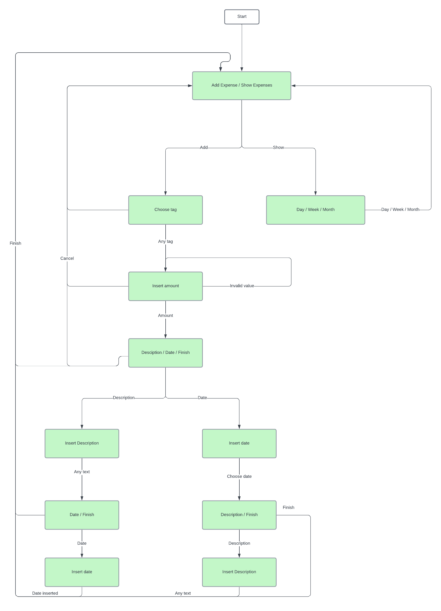

# About contribution

You can test NotionFacade via [ConsoleApp](./../src/main/java/com/dskroba/app/ConsoleApp.java).

To build your own image use
```shell
docker build -t expense-bot:<tag> .
docker tag expenses-bot:<tag> myregistry.io/myuser/expenses-bot:<tag>
docker push myregistry.io/myuser/expenses-bot:<tag>
```

Here is _almost_ correct description of bot state machine.
